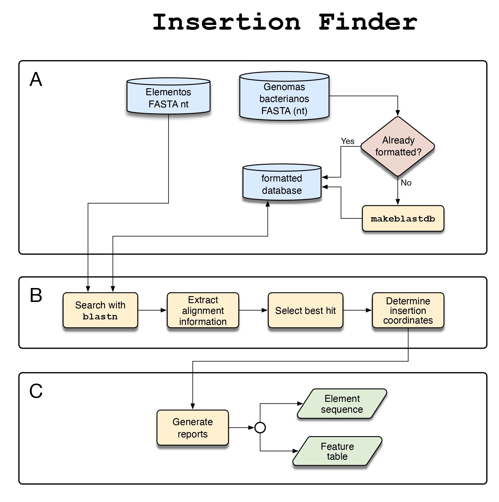

# insertion_finder - element insertion finder in a genome through a BLAST search

Insertion_finder is a tool in Python that performs similarity searches against genomic nucleotide sequences and automatically analyzes the results, identifying occurrences without the presence of the element. By comparing the sequences with and without the element, it is possible to accurately determine the 5' and 3' insertion points. 



##   Instalation

Insertion_finder does not need to be installed. The user should only download the insertion_finder.py file.

## Requirements


## Usage
```
python insertion_finder.py -q <query file> -run 'local' -d <database file> 
python insertion_finder.py -q <query file> -run 'web'
python insertion_finder.py -q <query file> -run 'local' -d <database file> -tab <BLASTn table file>
python insertion_finder.py -q <query file> -tab <BLASTn table file> 
```
### Mandatory parameters:
```
-q <file name>      Sequence to search with (fasta or multifasta file)
-run <local|web>    Choice of running local or web BLAST search
-d <file name>      Database to BLAST against (multifasta file)
```

### Optional parameters:
```
-conf <file name>   Configuration file
-tab <file name>    BLASTn search result table (fields: qseqid,sseqid,qcovs,qlen,slen,qstart,qend)(table file)
-org <integer>      Taxid(s) to restrict the database of the BLASTn search
-out <path|name>    Output directory
-minlen <integer>   Minimum element's length in base pairs(bp) (default: 5000)
-maxlen <integer>   Maximum element's length in base pairs(bp) (default: 50000)
-mincov <integer>   Minimum % query coverage per subject (default: 30)
-maxcov <integer>   Maximum % query coverage per subject (default: 90)
-enddist <integer>  Maximum distance between block end and query end in base pairs(bp) (default: 50)
-cpu <integer>      Number of threads to execute the blastn search (default: 10)
-color <string>     Element RGB color that is shown by the feature table, three integers between 0 and 255 separated by commas (default: 255,0,0)
``` 

## Contact

To report bugs, to ask for help and to give any feedback, please contact Arthur Gruber (argruber@usp.br) or Giuliana L. Pola (giulianapola@usp.br).